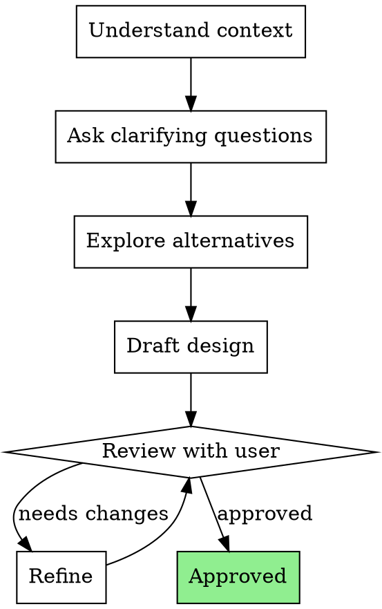

# Brainstorming Ideas Into Designs

Turn complex ideas into fully formed designs and specs through natural collaborative dialogue.

Start by understanding the project context (CLAUDE.md, codebase structure, existing patterns). Then ask questions incrementally to refine the idea before presenting a design for approval.

## Anti-Pattern: "This Is Too Simple To Need A Design"

Wrong. The simpler the idea seems, the more hidden complexity lurks. If you skip brainstorming for "simple" features, you WILL miss edge cases, create inconsistencies, or build the wrong thing.

**Exception:** Bug fixes with clear root cause, typo corrections, or single-line config changes genuinely don't need brainstorming.

## Checklist

Before starting implementation, verify:
- [ ] Understood the user's actual goal (not just what they said)
- [ ] Explored alternative approaches
- [ ] Identified edge cases and error scenarios
- [ ] Checked for existing patterns in the codebase
- [ ] Presented a design document for approval
- [ ] Got explicit approval before coding

## Process Flow

## The Process

### Phase 1: Context Gathering

1. Read CLAUDE.md, project structure, relevant code
2. Understand existing patterns and conventions
3. Identify constraints (tech stack, performance, compatibility)

### Phase 2: Collaborative Exploration

1. Ask clarifying questions — one or two at a time, not a wall of questions
2. Explore the user's intent behind their request
3. Surface assumptions and validate them
4. Identify edge cases through dialogue

### Phase 3: Design

1. Present a structured design document covering:
   - Goal and scope
   - Approach and architecture
   - Key decisions and trade-offs
   - Edge cases and error handling
   - Testing strategy
2. Save design spec to `docs/superpowers/specs/YYYY-MM-DD-<feature-name>-design.md`

### Phase 4: Approval and Handoff

1. Get explicit approval from user
2. Note any modifications requested during review
3. If implementation follows immediately:
   - **REQUIRED:** Use superpowers:using-git-worktrees to set up isolated workspace
   - **REQUIRED:** Use superpowers:writing-plans to create implementation plan

## Key Principles

- **Ask, don't assume** — When uncertain, ask. Wrong assumptions waste more time than questions.
- **Incremental refinement** — Don't dump 20 questions at once. 2-3 at a time, building on answers.
- **Show alternatives** — Present options with trade-offs, let user decide.
- **Respect existing patterns** — Don't reinvent what the codebase already solved.
- **Design documents are artifacts** — Save them. They're valuable for future reference.

## Visual Companion

See `visual-companion.md` in this directory for guidance on using diagrams and visual aids during brainstorming sessions.

## Spec Review

After drafting a design spec, dispatch a spec reviewer subagent using `spec-document-reviewer-prompt.md` to validate completeness and consistency before presenting to the user.

## Integration

**Leads to:**
- **superpowers:using-git-worktrees** — Set up workspace for implementation
- **superpowers:writing-plans** — Create implementation plan from approved design

**Related:**
- **superpowers:subagent-driven-development** — Execute the plan with subagents
- **superpowers:executing-plans** — Execute the plan inline
